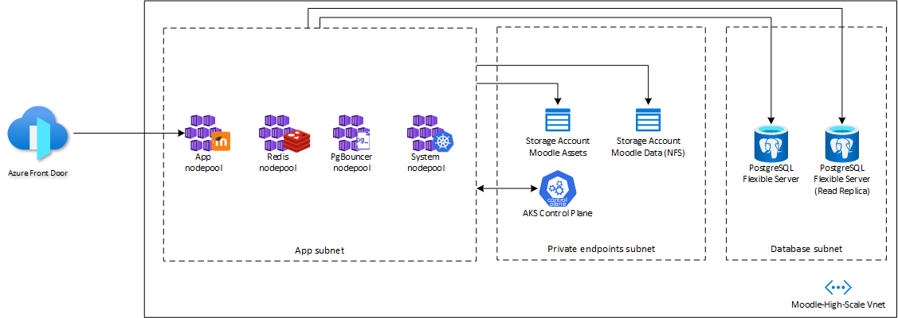

## About this project

This project deploys a robust infrastructure on Azure to handle a high scale moodle installation, this environment is able - and tested - to handle **200k concurrent users**.

It uses Azure Kubernetes Service to run Moodle, Azure Storage Account to host course content, Azure Database for PostgreSQL Flexible Server as its database and Azure Front Door to expose the application to the public as well as caching common used assets.



## Create the infrastructure using terraform

Provision the infrastructure.

```
$ cd infra/
$ az login
$ az group create --name moodle-high-scale --location <region>
$ terraform init
$ terraform plan -var moodle-environment=production
$ terraform apply -var moodle-environment=production
$ az aks get-credentials --name moodle-high-scale --resource-group moodle-high-scale
```

Provision the Redis Cluster.

```
$ cd ../manifests/redis-cluster
$ kubectl apply -f redis-configmap.yaml
$ kubectl apply -f redis-cluster.yaml
$ kubectl apply -f redis-service.yaml
```

Wait for all the replicas to be running.

```
$ ./init.sh
```
Type 'yes' when prompted.


Deploy Moodle and its services.


```
$ cd ../../images/moodle
$ az acr build --registry moodlehighscale<suffix> -t moodle:v0.1 --file Dockerfile .
$ cd ../pgbouncer
$ az acr build --registry moodlehighscale<suffix> -t pgbouncer:v0.1 --file Dockerfile .
$ cd ../../manifests

```
_After building images for moodle and pgbouncer, replace <acr-name> with the name of the container registry created by terraform in teh first steps, and also replace <storage-account-name> with the moodle data storage account name in the nfs-pv.yaml_ (see commented lines in the files)

```
$ kubectl apply -f pgbouncer-deployment.yaml
$ kubectl apply -f nfs-pv.yaml
$ kubectl apply -f nfs-pvc.yaml
$ kubectl apply -f moodle-service.yaml
$ kubectl -n moodle get svc --watch
```

Provision the frontend configuration that will be used to expose Moodle and its assets publicly.

```
$ cd ../frontend
$ terraform init
$ terraform plan
$ terraform apply
```

Approve the private endpoint connection request from Frontdoor in moodle-svc-pls resource in the following path in the Azure Portal:

_Private Link Services > moodle-svs-pls > Private Endpoint Connections > Select the request from Front Door and click on Approve._

Install database.

```
$ kubectl -n moodle exec -it deployment/moodle-deployment -- /bin/bash 
$ php /var/www/html/admin/cli/install_database.php --adminuser=admin_user --adminpass=admin_pass --agree-license
```

Deploy Moodle Cron.

_Open moodle-cron.yaml and replace <acr-name> with the name of the container registry created by terraform in the first steps_

```
$ cd ../manifests
$ kubectl apply -f moodle-cron.yaml
```

Your Moodle installation is now ready to use.